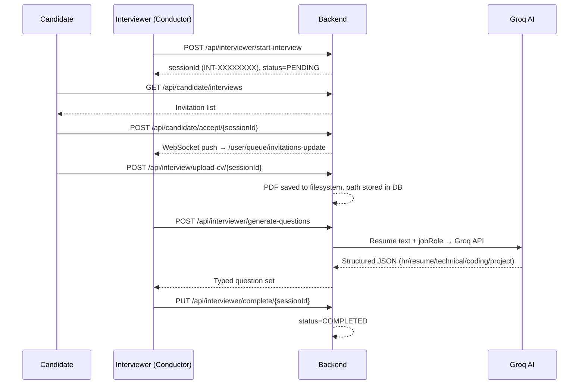
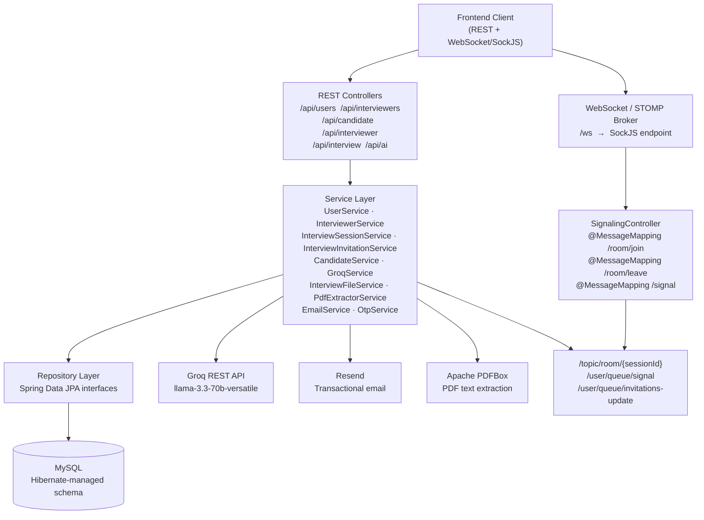
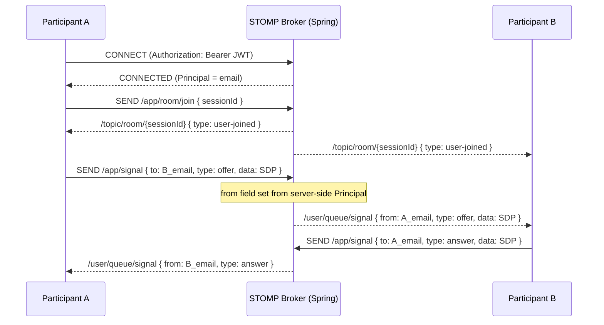
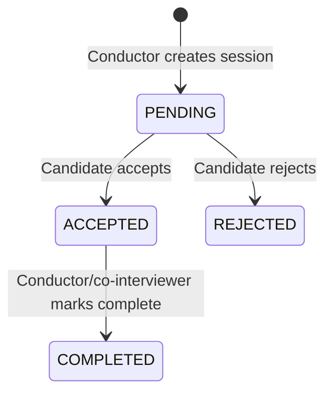

# Smart Interview System — Backend

A Spring Boot backend for orchestrating structured technical interviews: multi-party session management, OTP-verified authentication, resume-aware AI question generation, and real-time state synchronization via WebSocket.

**Java 25 · Spring Boot 4.1 · Spring Security · JWT · MySQL · JPA/Hibernate · Groq AI (Llama 3.3 70B) · WebSocket/STOMP · Apache PDFBox · Resend · Docker**

---

## Engineering Snapshot

| Area | Implementation |
|---|---|
| Language | Java 25 |
| Framework | Spring Boot 4.1.0 |
| Security | Spring Security 6 + JJWT 0.12.7 (HMAC-SHA256) |
| Persistence | Spring Data JPA / Hibernate (`ddl-auto=update`) |
| Database | MySQL |
| AI | Groq API — `llama-3.3-70b-versatile` |
| Real-time | Spring WebSocket + STOMP over SockJS |
| Document Processing | Apache PDFBox 3.0.5 |
| Email | Resend Java SDK 4.11.0 |
| Build | Maven (Maven Wrapper included) |
| Containerization | Docker (`eclipse-temurin:25-jdk`) |
| Testing | Spring Boot Test — context validation only |

---

## What This System Does

Two principal roles — **Candidate** and **Interviewer** — interact through a structured workflow:



A session supports one conductor, one candidate, and up to three additional co-interviewers. Every status transition is pushed in real time to all participants' dashboards via STOMP user-private queues.

---

## Engineering Problem

Coordinating a structured technical interview requires solving several independent engineering problems simultaneously:

- **Authentication symmetry** — Two distinct user types (Candidate, Interviewer) with separate registration flows, OTP verification, and password-reset lifecycles but a single shared JWT filter.
- **Multi-party session orchestration** — Creating a session that atomically validates the existence of up to five participants across two tables and enforces uniqueness constraints before persisting.
- **Resume-contextual AI generation** — Extracting raw text from a candidate's PDF resume and constructing an LLM prompt that yields a typed, categorized question set rather than a generic question list.
- **Real-time state synchronization** — Eliminating polling: when a candidate accepts or rejects, every relevant interviewer's dashboard updates immediately over WebSocket without a page refresh.
- **Secure document access** — CV files must be readable only by verified session participants; a 403 is returned to all others.

---

## System Architecture



| Layer | Responsibility |
|---|---|
| Controllers | HTTP routing; delegate all logic to services; return DTOs |
| Services | Business rules, orchestration, external API calls |
| Repositories | Spring Data JPA interfaces; no raw SQL |
| Security | `JwtAuthenticationFilter`, `CustomUserDetailsService`, `SecurityConfig` |
| Config | `GroqConfig`, `WebSocketConfig`, `SecurityConfig` bind `@Value` properties |

---

## Java / Spring Boot Engineering

### Layered architecture and dependency injection
Controllers hold no business logic — they extract HTTP context (path variables, `Authentication` principal) and delegate to `@Service` beans injected via constructor or field injection.

### DTO isolation
Every API boundary uses dedicated request/response DTOs (`RegisterRequest`, `StartInterviewRequest`, `InterviewInvitationResponse`, etc.). JPA entities are never exposed directly, keeping persistence details internal.

### Bean Validation
`@Valid` on controller method parameters triggers Jakarta validation constraints defined in DTOs: `@NotBlank`, `@Email`, `@Pattern`, `@Size`. A `@RestControllerAdvice` catches `MethodArgumentNotValidException` and returns a structured field-level error map.

### Repository abstraction
Seven Spring Data JPA interfaces provide all persistence with zero boilerplate. Custom queries are expressed as method names: `findByCandidateEmail`, `findByInterviewer2`, `findByEmailAndVerifiedTrue`.

### Configuration management
All secrets and environment-specific values are externalised as `${ENV_VAR}` property placeholders. `GroqConfig` binds three AI properties via `@Value` and exposes them as a typed bean, keeping service code free of raw `@Value` injection.

### Global exception handling
`GlobalExceptionHandler` centralises validation error responses. Runtime exceptions from services bubble up but are not currently caught uniformly — a gap addressed in the roadmap.

### Stateless session management
`SessionCreationPolicy.STATELESS` prevents any server-side session. Every request is authenticated entirely from the JWT in the `Authorization` header.

---

## Security Architecture

### Authentication flow

```
POST /api/users/login  (or /api/interviewers/login)
       │
       ▼
AuthenticationManager.authenticate()
       │
       ▼
CustomUserDetailsService.loadUserByUsername(email)
  → searches users table, then interviewers table
       │
       ▼
BCryptPasswordEncoder.matches()
       │
       ▼
JwtUtil.generateToken(email, role)
  → HS256 signed, role embedded as claim
  → default expiry 86400000 ms (24 h)
       │
       ▼
Response: { success, message, token, role }

─── subsequent requests ────────────────────────

Authorization: Bearer <token>
       │
       ▼
JwtAuthenticationFilter (OncePerRequestFilter)
  → extractEmail(token)
  → loadUserByUsername(email)
  → validateToken (signature + expiry)
  → setAuthentication in SecurityContextHolder
       │
       ▼
Spring Security authorizeHttpRequests
  → ROLE_CANDIDATE → /api/candidate/**
  → ROLE_INTERVIEWER → /api/interviewer/**
```

### WebSocket authentication
A `ChannelInterceptor` inside `WebSocketConfig` intercepts every STOMP `CONNECT` frame. If a valid `Authorization: Bearer <token>` header is present, the email is set as the connection's `Principal`. Signal messages take the `from` field from this server-side `Principal`, not the client payload — identity spoofing is therefore not possible over the signal channel.

### OTP-verified registration
Registration is two-phase: credentials are stored in a staging table (`pending_registration` / `pending_interviewer_registration`) with a 5-minute OTP and expiry timestamp. Verification moves the record to the live table and deletes the staging entry. Password reset requires the OTP to be in `verified=true` state before the new password hash is written.

### Role-based access control

| Role | Source table | Protected namespace |
|---|---|---|
| `ROLE_CANDIDATE` | `users` | `/api/candidate/**` |
| `ROLE_INTERVIEWER` | `interviewers` | `/api/interviewer/**` |

### CV download authorization
`InterviewFileController` explicitly checks whether the authenticated email matches the session's `candidateEmail`, `conductorEmail`, `interviewer2`, `interviewer3`, or `interviewer4` before serving the file. Non-participants receive HTTP 403.

### Security strengths
- Stateless JWT with role claim; no session fixation risk
- BCrypt password hashing
- OTP expiry enforced server-side
- Participant-level file access control
- CORS restricted to two known origins
- WebSocket `from` field set server-side

### Security gaps
- AI endpoints (`/api/ai/generate-from-resume`, `/api/interviewer/generate-questions`) are `permitAll()` — unauthenticated callers consume Groq API quota
- No JWT revocation mechanism before expiry
- No upload file type or size validation
- No rate limiting on OTP, login, or AI endpoints

---

## AI Engineering

Two independent pipelines share the same model, prompt template, and parsing logic.

### Pipeline A — session-based generation

```
POST /api/interviewer/generate-questions
  { sessionId, jobRole }
         │
         ▼
PdfExtractorService.extractCvText(sessionId)
  → looks up cv_path in interview_sessions
  → Loader.loadPDF(File) + PDFTextStripper
         │
         ▼
text.substring(0, 12000)   ← 12 k-char safety cap
         │
         ▼
Java text block prompt
  "You are a Senior Technical Interviewer.
   Resume: <text>  Job Role: <jobRole>
   Return ONLY valid JSON: { hr, resume, technical, coding, project }"
         │
         ▼
POST https://api.groq.com/openai/v1/chat/completions
  model: llama-3.3-70b-versatile
  Authorization: Bearer GROQ_API_KEY
         │
         ▼
choices[0].message.content
  → strip accidental ```json fences
  → ObjectMapper.readValue(content, Object.class)
         │
         ▼
GroqResponse { success, message, questions }
```

### Pipeline B — standalone generation

`POST /api/ai/generate-from-resume` accepts a `MultipartFile` and `jobRole` string directly. `ResumePdfExtractorService` loads the PDF from bytes (`Loader.loadPDF(file.getBytes())`), so no session or filesystem read is required. The same 12 k cap, prompt template, and parsing logic apply.

### Question schema

| Category | Pipeline A count | Pipeline B count |
|---|---|---|
| `hr` | 3 | 2 |
| `resume` | 3 | 3 |
| `technical` | 10 | 15 |
| `coding` | 2 | 3 |
| `project` | 5 | 3 |

Every question includes an `answer` field.

### Failure handling
Both pipelines wrap the entire flow in `try/catch`. Any exception (network failure, JSON parse error, malformed PDF) returns `{ success: false, message: <exception message> }` — the HTTP response is always 200. A 5xx is never propagated to the client.

### Planned improvements
- HTTP timeout configuration on the `RestTemplate` instance
- Retry with backoff on transient Groq failures
- Schema validation before deserializing the model's JSON response
- Authentication guard on pipeline B
- Async processing to avoid blocking a servlet thread during model inference

---

## Real-Time Architecture



**Why WebSocket here?**
When a candidate accepts an invitation, up to four interviewers need their dashboard updated. Polling every interviewer independently would require each client to poll at a fixed interval, create unnecessary load, and still lag by the poll period. WebSocket user-destination push delivers the update in under a round-trip latency with no polling overhead.

**Destination reference**

| Direction | Destination | Payload |
|---|---|---|
| Client sends | `/app/room/join` | `{ sessionId }` |
| Client sends | `/app/room/leave` | `{ sessionId }` |
| Client sends | `/app/signal` | `{ to, type, data }` |
| Server broadcasts | `/topic/room/{sessionId}` | `{ type: "user-joined|user-left", participantId }` |
| Server → user | `/user/queue/signal` | `{ from, type, data }` |
| Server → user | `/user/queue/invitations-update` | `[ InterviewInvitationResponse ]` |

**Known limitation:** Room membership is tracked in a `ConcurrentHashMap<String, CopyOnWriteArraySet<String>>` held in the application process. Presence state resets on restart and cannot be shared across multiple instances. Replacing this with Redis Pub/Sub would be required for horizontal scaling.

---

## Interview Domain Model



**Session structure**

| Role | Constraint |
|---|---|
| Conductor | Exactly one; must be an authenticated `ROLE_INTERVIEWER` |
| Candidate | Exactly one; must exist in `users` table |
| Co-interviewers (2–4) | Optional; each must exist in `interviewers` table |
| All participants | No duplicate emails within a session |

**Authorization rules**
- Only the session's candidate may upload a CV or change the session status via accept/reject
- Only the conductor or a co-interviewer may call `complete`
- CV download requires the caller to be any session participant

Email addresses are normalised (`trim().toLowerCase()`) before comparison and persistence to prevent case-sensitivity inconsistencies.

---

## Database Architecture

Schema is managed by `spring.jpa.hibernate.ddl-auto=update` — suitable for development; **Flyway or Liquibase is recommended for any persistent environment**.

| Table | Entity | Key columns |
|---|---|---|
| `users` | `User` | `id` PK, `email` UNIQUE, `phone` UNIQUE, `name`, `password` (BCrypt), `role` |
| `interviewers` | `Interviewer` | `id` PK, `email` UNIQUE, `phone` UNIQUE, `name`, `companyName`, `password` (BCrypt), `role` |
| `interview_sessions` | `InterviewSession` | `id` PK, `session_id` UNIQUE, `conductor_email`, `candidate_email`, `interviewer2/3/4` (nullable), `status`, `cv_path` (nullable), `created_at` |
| `otp_details` | `OtpDetails` | `id` PK, `email` UNIQUE, `otp`, `expiry_time`, `verified` |
| `interviewer_otp_details` | `InterviewerOtpDetails` | `id` PK, `email` UNIQUE, `otp`, `created_at`, `expiry_time`, `verified` |
| `pending_registration` | `PendingRegistration` | `id` PK, `email` UNIQUE, `phone` UNIQUE, `name`, `password` (BCrypt), `otp`, `created_at`, `expiry_time` |
| `pending_interviewer_registration` | `PendingInterviewerRegistration` | `id` PK, `email` UNIQUE, `phone` UNIQUE, `name`, `companyName`, `password` (BCrypt), `otp`, `created_at`, `expiry_time` |

**Relationship model:** `interview_sessions` stores participant identities as plain email strings, not foreign key references. This is an **application-level reference** — participant existence is validated in `InterviewSessionService` at creation time, not enforced by the database schema. The trade-off is simpler joins at the cost of no referential integrity at the DB level.

---

## API Design

### Candidate authentication — `/api/users` (public)

| Method | Endpoint | Purpose |
|---|---|---|
| `POST` | `/register` | Submit registration; triggers OTP email |
| `POST` | `/verify-registration` | Verify OTP; creates `users` record |
| `POST` | `/login` | Authenticate; returns JWT + role |
| `POST` | `/forgot-password` | Send password-reset OTP |
| `POST` | `/verify-otp` | Mark OTP as verified |
| `POST` | `/reset-password` | Update password (requires verified OTP) |

### Interviewer authentication — `/api/interviewers` (public)

| Method | Endpoint | Purpose |
|---|---|---|
| `POST` | `/register` | Submit registration; triggers OTP email |
| `POST` | `/verify-registration` | Verify OTP; creates `interviewers` record |
| `POST` | `/login` | Authenticate; returns JWT + role |
| `POST` | `/forgot-password` | Send password-reset OTP |
| `POST` | `/verify-otp` | Mark OTP as verified |
| `POST` | `/reset-password` | Update password (requires verified OTP) |

### Candidate — `/api/candidate` (`ROLE_CANDIDATE`)

| Method | Endpoint | Purpose |
|---|---|---|
| `GET` | `/home` | Dashboard data (name, email, status) |
| `GET` | `/interviews` | All invitations for this candidate |
| `POST` | `/accept/{sessionId}` | Accept; pushes update to interviewers |
| `POST` | `/reject/{sessionId}` | Reject; pushes update to interviewers |

### Interviewer — `/api/interviewer` (`ROLE_INTERVIEWER`)

| Method | Endpoint | Purpose |
|---|---|---|
| `GET` | `/home` | Dashboard data |
| `POST` | `/start-interview` | Create session; validate and persist participants |
| `GET` | `/interviews` | Sessions where caller is conductor |
| `GET` | `/invitations` | Accepted sessions where caller is co-interviewer |
| `GET` | `/session/{sessionId}` | Session detail and participant list |
| `PUT` | `/complete/{sessionId}` | Mark session COMPLETED |
| `POST` | `/generate-questions` | AI questions from uploaded CV (session-based) |

### Resume — `/api/interview` (JWT required)

| Method | Endpoint | Auth constraint |
|---|---|---|
| `POST` | `/upload-cv/{sessionId}` | Candidate of this session only |
| `GET` | `/download-cv/{sessionId}` | Any session participant |

### AI — `/api/ai` (public — see security gaps)

| Method | Endpoint | Purpose |
|---|---|---|
| `POST` | `/generate-from-resume` | Upload PDF + `jobRole` → structured question set |

---

### Key API examples

**Register a candidate**
```bash
curl -X POST http://localhost:8080/api/users/register \
  -H "Content-Type: application/json" \
  -d '{"name":"Jane Smith","email":"jane@example.com","phone":"9876543210",
       "password":"Secure@123","confirmPassword":"Secure@123"}'
```

**Login**
```bash
curl -X POST http://localhost:8080/api/users/login \
  -H "Content-Type: application/json" \
  -d '{"email":"jane@example.com","password":"Secure@123"}'
# → { "success": true, "token": "<JWT>", "role": "ROLE_CANDIDATE" }
```

**Create an interview session**
```bash
curl -X POST http://localhost:8080/api/interviewer/start-interview \
  -H "Authorization: Bearer $INTERVIEWER_TOKEN" \
  -H "Content-Type: application/json" \
  -d '{"candidateEmail":"jane@example.com","interviewer2":"panel@example.com",
       "interviewer3":null,"interviewer4":null}'
# → { "success": true, "sessionId": "INT-4F2A9C1B" }
```

**Upload a CV**
```bash
curl -X POST http://localhost:8080/api/interview/upload-cv/INT-4F2A9C1B \
  -H "Authorization: Bearer $CANDIDATE_TOKEN" \
  -F "file=@resume.pdf"
```

**Generate AI questions**
```bash
curl -X POST http://localhost:8080/api/interviewer/generate-questions \
  -H "Authorization: Bearer $INTERVIEWER_TOKEN" \
  -H "Content-Type: application/json" \
  -d '{"sessionId":"INT-4F2A9C1B","jobRole":"Backend Java Engineer"}'
```

---

## Project Structure

```
src/main/java/com/example/loginsystem/
├── config/
│   ├── GroqConfig.java              # @Value bindings for Groq API properties
│   ├── SecurityConfig.java          # FilterChain, CORS, RBAC rules, BCrypt bean
│   └── WebSocketConfig.java         # STOMP broker, SockJS, JWT ChannelInterceptor
├── controller/                      # Thin HTTP delegates — no business logic
│   ├── UserController.java          # /api/users
│   ├── InterviewerController.java   # /api/interviewers
│   ├── CandidateController.java     # /api/candidate/home
│   ├── CandidateInterviewController.java  # /api/candidate/interviews, accept, reject
│   ├── InterviewerHomeController.java     # /api/interviewer/home
│   ├── InterviewerInterviewController.java # /api/interviewer/interviews, invitations
│   ├── InterviewSessionController.java    # start-interview, session, complete
│   ├── InterviewFileController.java       # upload-cv, download-cv
│   ├── GroqController.java                # /api/interviewer/generate-questions
│   ├── ResumeQuestionGeneratorController.java # /api/ai/generate-from-resume
│   ├── SignalingController.java      # WebSocket @MessageMapping
│   └── DashboardController.java      # /api/dashboard
├── service/                          # Business logic and orchestration
├── repository/                       # Spring Data JPA interfaces
├── entity/                           # JPA-mapped database entities
├── dto/                              # Request and response transfer objects
├── security/
│   ├── JwtUtil.java                  # Token generation, extraction, validation
│   ├── JwtAuthenticationFilter.java  # OncePerRequestFilter — JWT → SecurityContext
│   ├── JwtAuthenticationEntryPoint.java # 401 on unauthenticated access
│   └── CustomUserDetailsService.java # Searches users then interviewers tables
├── exception/
│   └── GlobalExceptionHandler.java   # @RestControllerAdvice for validation errors
├── model/
│   └── SignalMessage.java            # WebRTC signal envelope
└── response/
    └── ApiResponse.java              # Unified success/message/token/role wrapper
```

---

## Configuration & Secrets

All sensitive values are externalised as environment variables. No credentials appear in source files.

| Variable | Purpose | Default |
|---|---|---|
| `DB_URL` | JDBC connection string | — |
| `DB_USERNAME` | Database user | — |
| `DB_PASSWORD` | Database password | — |
| `JWT_SECRET` | HMAC-SHA256 signing key (≥32 chars) | — |
| `JWT_EXPIRATION` | Token lifetime (ms) | `86400000` (24 h) |
| `GROQ_API_KEY` | Groq AI API key | — |
| `RESEND_API_KEY` | Resend email API key | — |
| `RESEND_FROM_EMAIL` | Sender address | — |
| `PORT` | HTTP server port | `8080` |

```bash
# .env (development only — never commit to version control)
DB_URL=jdbc:mysql://localhost:3306/smart_interview
DB_USERNAME=your_username
DB_PASSWORD=your_password
JWT_SECRET=replace_with_32_or_more_random_characters
GROQ_API_KEY=gsk_...
RESEND_API_KEY=re_...
RESEND_FROM_EMAIL=noreply@yourdomain.com
```

---

## Local Development

### Prerequisites

| Dependency | Version |
|---|---|
| JDK | 25 |
| MySQL | 8.x |
| Maven | 3.9+ or use `./mvnw` |

### Setup

```bash
# Clone
git clone <repository-url>
cd SmartInterviewSystem-backend-main

# Create database
mysql -u root -p -e "CREATE DATABASE smart_interview CHARACTER SET utf8mb4;"

# Export environment variables (or source a .env file)
export DB_URL=jdbc:mysql://localhost:3306/smart_interview
export DB_USERNAME=root
export DB_PASSWORD=yourpassword
export JWT_SECRET=a_long_random_secret_string_here
export GROQ_API_KEY=your_groq_key
export RESEND_API_KEY=your_resend_key
export RESEND_FROM_EMAIL=noreply@yourdomain.com

# Build (skip tests — context test requires DB connection)
./mvnw clean package -DskipTests

# Run
java -jar target/LoginSystem-0.0.1-SNAPSHOT.jar

# Health check
curl http://localhost:8080/
# Expected: Smart Interview System Backend is running!
```

Hibernate creates all tables on first startup via `ddl-auto=update`.

---

## Docker

The `Dockerfile` builds the application from source inside the container.

```dockerfile
FROM eclipse-temurin:25-jdk
WORKDIR /app
COPY . .
RUN chmod +x mvnw && ./mvnw clean package -DskipTests
EXPOSE 8080
ENTRYPOINT ["java", "-jar", "target/LoginSystem-0.0.1-SNAPSHOT.jar"]
```

```bash
# Build image
docker build -t smart-interview-backend .

# Run — supply all required environment variables
docker run -p 8080:8080 \
  -e DB_URL=jdbc:mysql://host.docker.internal:3306/smart_interview \
  -e DB_USERNAME=root \
  -e DB_PASSWORD=yourpassword \
  -e JWT_SECRET=your_secret \
  -e GROQ_API_KEY=your_groq_key \
  -e RESEND_API_KEY=your_resend_key \
  -e RESEND_FROM_EMAIL=noreply@yourdomain.com \
  smart-interview-backend
```

> No `docker-compose.yml` exists in this repository. The database must be provisioned separately.

---

## Testing

```bash
./mvnw test
```

**Current state:** One test class exists — `LoginSystemApplicationTests` — which verifies that the Spring application context loads successfully. No service, repository, controller, or integration tests are written.

### Testing roadmap

| Test type | Tool | Coverage target |
|---|---|---|
| Service unit tests | JUnit 5 + Mockito | `InterviewSessionService`, `UserService`, `InterviewInvitationService` |
| Controller integration | `@WebMvcTest` + `MockMvc` | All REST controllers, auth filter, validation |
| Repository slice tests | `@DataJpaTest` | Custom query methods |
| Full integration | `@SpringBootTest` + Testcontainers | End-to-end session lifecycle, AI mock |
| WebSocket tests | Spring WebSocket test support | STOMP send/subscribe flows |

---

## Observability & Reliability

**Current implementation:**
- `System.out.println` and `e.printStackTrace()` are used throughout services for logging
- `GlobalExceptionHandler` handles validation errors consistently
- AI and file service errors are caught and returned as `success: false` responses
- No metrics, health endpoints, or distributed tracing are configured

### Production reliability roadmap

- Replace console output with SLF4J + structured logging (JSON format for log aggregators)
- Enable Spring Boot Actuator (`/actuator/health`, `/actuator/metrics`)
- Add `RestTemplate` connection and read timeout configuration (currently unbounded)
- Implement retry with exponential backoff for Groq API calls
- Add `@Transactional` annotations on service methods that perform multiple writes
- Integrate a monitoring backend (Prometheus + Grafana or cloud equivalent)

---

## Engineering Trade-offs

### Local filesystem vs. object storage
CVs are stored in an `uploads/` directory relative to the working directory. This is straightforward for a single-instance local environment but creates data loss risk on container restart and is incompatible with multi-instance deployments. S3 or GCS would be the natural replacement.

### JWT without revocation
Stateless JWT eliminates server-side session management but makes immediate token invalidation (e.g., on logout or account suspension) impossible without a token denylist. The current 24-hour expiry is the only revocation mechanism.

### In-memory WebSocket room state
`roomParticipants` is a `ConcurrentHashMap` in the application process. It is appropriate for a single instance but resets on restart. A Redis Pub/Sub broker integration would be required for horizontal scaling.

### `ddl-auto=update` vs. migration tooling
Hibernate's `update` mode is convenient during active schema development but is not idempotent and does not roll back failed changes. Flyway or Liquibase would provide versioned, repeatable, reviewable schema migrations for any shared environment.

### Direct Groq API integration
Using `RestTemplate` to call the Groq API directly is straightforward but provides no circuit breaking, retry isolation, or fallback behaviour. Resilience4j or Spring Cloud Circuit Breaker would add production resilience without changing the service interface.

### Email-based participant references
Session participants are stored by email string rather than foreign key. This simplifies queries across the `users` / `interviewers` table boundary but sacrifices referential integrity at the database level.

---

## Production Readiness

| Area | Current State | Production Recommendation |
|---|---|---|
| Authentication | JWT + BCrypt + OTP-verified registration | Add JWT denylist or short-lived refresh tokens |
| Authorization | Role-based, participant-level file auth | Audit AI endpoints; add method-level `@PreAuthorize` |
| Testing | Context load only | Unit, integration, and contract tests |
| File storage | Local filesystem | Object storage (S3/GCS) with signed URLs |
| AI reliability | Single attempt, 200-always | Timeout + retry + circuit breaker |
| Logging | Console output | SLF4J structured logging + aggregator |
| Rate limiting | None | Spring Cloud Gateway or Bucket4j on OTP/login/AI |
| Schema management | `ddl-auto=update` | Flyway with versioned migrations |
| WebSocket scaling | In-memory room state | Redis Pub/Sub STOMP broker |
| Secret management | Environment variables | Secrets manager (Vault, AWS SSM, etc.) |

---

## Security & Technical Risks

| Risk | Impact | Mitigation |
|---|---|---|
| AI endpoints are `permitAll()` | Unauthenticated callers consume Groq quota | Require `ROLE_INTERVIEWER` JWT; add rate limiting |
| No upload validation | Arbitrary files accepted by the upload endpoint | Validate MIME type (`application/pdf`) and enforce max size |
| No JWT revocation | Compromised tokens valid until expiry | Introduce short expiry + refresh token rotation, or a Redis denylist |
| No rate limiting on OTP/login | Brute-force exposure | Add rate limiter (Bucket4j or API gateway) |
| Filesystem CV storage | Data loss on container restart; not multi-instance compatible | Migrate to object storage |
| In-memory room state | Loss of presence data on restart; single-instance only | Redis Pub/Sub broker |
| `System.out.println` logging | No structured audit trail; log injection risk | Replace with SLF4J + structured format |
| `ddl-auto=update` in any non-dev environment | Silent schema drift; no rollback path | Migrate to Flyway |

---

## Engineering Highlights

| Area | Demonstrated Capability |
|---|---|
| Java / Spring Boot | Layered architecture, DI, service orchestration, configuration management |
| Security | Dual-table `UserDetailsService`, custom JWT filter, role-based route protection, OTP-gated two-phase registration |
| JPA / Hibernate | Seven entity mappings, Spring Data query methods, auto-schema generation |
| REST design | DTO isolation, Bean Validation, structured error responses, `@RestControllerAdvice` |
| WebSocket / STOMP | SockJS, JWT auth on CONNECT frame, server-side Principal, user-private and broadcast destinations |
| AI integration | PDF extraction pipeline, structured LLM prompt engineering, JSON parsing, graceful failure |
| File handling | Multipart upload, server-side path persistence, participant-gated download |
| Domain modelling | Multi-party session lifecycle, status machine, duplicate and existence validation |
| Docker | Source-build image, environment-variable-driven runtime configuration |
| Engineering judgment | Meaningful trade-offs documented; limitations acknowledged; production roadmap defined |

---

## Interview Talking Points

Questions a Java interviewer would naturally ask when reviewing this codebase:

1. Why JWT over server sessions, and what is the key limitation of that choice here?
2. Walk me through how `CustomUserDetailsService` handles two different user types in a single `loadUserByUsername` call.
3. How does the `JwtAuthenticationFilter` avoid re-authenticating already-authenticated requests?
4. How is WebSocket authentication implemented without relying on the HTTP security context?
5. What would need to change to support multiple server instances for the WebSocket room tracking?
6. Why are participants stored as email strings rather than foreign keys, and what does that cost you?
7. How would you test `InterviewSessionService.startInterview` in isolation?
8. What are the risks of `ddl-auto=update` in a shared staging environment?
9. How would you add retry logic to the Groq API call without changing the controller interface?
10. What is the security consequence of `/api/ai/generate-from-resume` being public?
11. If a candidate uploads a non-PDF file, what happens? How would you fix it?
12. How would you migrate CV storage from the local filesystem to Amazon S3 with minimal changes to the service layer?

---

## Future Roadmap

**Implemented**
- OTP-verified two-phase registration for both user types
- Stateless JWT authentication with role-based access control
- Multi-party interview session lifecycle (up to four interviewers)
- Real-time dashboard synchronization via WebSocket user-private queues
- WebRTC signalling relay
- Resume upload with participant-gated download
- PDF-to-text extraction via Apache PDFBox
- Session-based and standalone AI question generation via Groq
- Dockerized build from source

**Planned**
- Object storage (S3/GCS) for CV files
- Flyway database migrations
- Rate limiting on OTP, login, and AI endpoints
- Authentication guard on AI endpoints
- JWT refresh/revocation mechanism
- Redis Pub/Sub for horizontally-scalable WebSocket rooms
- `RestTemplate` timeout and retry configuration for Groq
- Spring Boot Actuator for health and metrics
- Structured SLF4J logging with correlation IDs
- JUnit 5 / Mockito service tests and MockMvc controller tests
- Transactional email HTML templates
- Scheduled cleanup of expired OTP and pending-registration records

---

## Project Status

**Functional backend under active development. Core interview lifecycle, AI question generation, and real-time communication are working. Production hardening — rate limiting, file validation, migration tooling, comprehensive testing, and object storage — is planned but not yet implemented.**

---

*All features, endpoints, entities, and technical details in this document are verified against the actual source code.*
